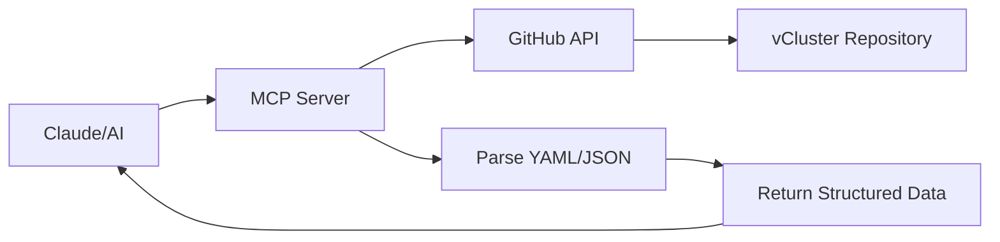

# vCluster YAML MCP Server

A Model Context Protocol (MCP) server that lets AI assistants query and validate [vCluster](https://github.com/loft-sh/vcluster) YAML configurations directly from GitHub.

## What Does It Do?

This MCP server provides AI assistants with tools to:
- Query vCluster configuration options and schemas
- Validate YAML configurations
- Search for specific settings using natural language
- Switch between different vCluster versions
- Extract validation rules from comments

**Key feature:** No local files needed. All data is fetched live from the vCluster GitHub repository.

## How It Works

The server uses the GitHub API to fetch vCluster YAML configurations, schemas, and documentation directly from the source:

1. **GitHub as Source of Truth**: Queries `github.com/loft-sh/vcluster` repository
2. **Version Control**: Can switch between any tag (e.g., `v0.19.0`) or branch (e.g., `main`)
3. **Live Data**: Always fetches the latest configuration for the selected version
4. **Smart Caching**: 15-minute in-memory cache to avoid overloading GitHub API



## Installation

### Option 1: Local (stdio)

Run the server locally via npx:

```json
{
  "mcpServers": {
    "vcluster-yaml": {
      "command": "npx",
      "args": ["-y", "vcluster-yaml-mcp-server"]
    }
  }
}
```

### Option 2: Remote (HTTP)

Use the public instance (always running latest version):

```json
{
  "mcpServers": {
    "vcluster-yaml": {
      "type": "http",
      "url": "https://vcluster-yaml.cloudrumble.net/mcp"
    }
  }
}
```

## Available Tools

### Version Management

**list-versions** - Browse all available vCluster versions
```javascript
// Returns tags (releases) and branches
// Example output: v0.19.0, v0.20.0, main, etc.
```

**set-version** - Switch to a specific version
```javascript
set-version --ref="v0.19.0"  // Stable release
set-version --ref="main"      // Latest development
```

**get-current-version** - Check which version is active
```javascript
// Returns: Currently using: v0.19.0
```

### Configuration Queries

**smart-query** - Universal search using dot notation or natural language
```javascript
smart-query --query="controlPlane.ingress.enabled"
smart-query --query="namespace syncing"
smart-query --query="etcd"
// Returns: Matching configuration paths and their values
```

**list-configs** - Browse available YAML files
```javascript
list-configs --path="config"  // Default
list-configs --path="chart"   // Helm chart configs
// Returns: File paths and sizes
```

### Validation & Schema

**validate-config** - Check YAML syntax and structure
```javascript
validate-config --content="<yaml>"
// Returns: { syntax_valid: true, config_paths: [...], validation_data: {...} }

validate-config --file="chart/values.yaml"
// Validates a specific file from GitHub
```

**get-schema** - Fetch JSON Schema for vCluster
```javascript
get-schema                           // Top-level overview
get-schema --section="controlPlane"  // Specific section
get-schema --path="sync.toHost"      // Nested path
// Returns: JSON Schema for the specified section
```

**extract-validation-rules** - Get validation rules from YAML comments
```javascript
extract-validation-rules --section="controlPlane"
// Returns: { rules, enums, dependencies, defaults }
// Extracts constraints like "Valid values: a, b, c"
```

**get-config-metadata** - Full configuration metadata
```javascript
get-config-metadata --file="chart/values.yaml"
// Returns: { fields, tree_structure, comments, types }
```

## Usage Examples

### Validate a Custom Configuration

Ask Claude:
> "Can you validate this vCluster config and check if the controlPlane settings are correct?"

Claude will use:
- `validate-config` to check syntax
- `get-schema` for controlPlane schema
- `extract-validation-rules` for validation constraints

### Explore vCluster Options

Ask Claude:
> "What high availability options are available in vCluster v0.19.0?"

Claude will use:
- `set-version` to switch to v0.19.0
- `smart-query` to find HA-related settings

### Compare Versions

Ask Claude:
> "How did the sync.fromHost configuration change between v0.19.0 and v0.20.0?"

Claude will use:
- `set-version` to switch between versions
- `smart-query` to fetch the same config from both versions

## Token Optimization

This server is designed for efficient token usage:

| Tool | Tokens | Strategy |
|------|--------|----------|
| validate-config | ~500 | Returns paths only, not full config |
| get-schema | ~50-100 | Section filtering prevents full schema dump |
| smart-query | ~1-2K | Limits results to 50 matches |
| extract-validation-rules | ~2-5K | Section-specific filtering |

## Architecture Philosophy

**Data-First, Not Logic-First**

The server returns structured data and lets the AI reason about validation. 
- Adapts automatically when vCluster changes
- Works across versions without updates
- Leverages AI's reasoning vs rigid code
- Reduces maintenance burden

## Development

```bash
# Install dependencies
npm install

# Run locally (stdio)
node src/index.js

# Test with MCP Inspector
npx @modelcontextprotocol/inspector node src/index.js
# Open http://localhost:5173

# Run tests
npm test  # 59 tests, all passing

# Run HTTP server locally
npm run start:http
# Server runs on http://localhost:3000
```

## Technical Details

- **SDK**: `@modelcontextprotocol/sdk` v1.20.1 (Streamable HTTP transport)
- **Node**: >=18
- **Transport**: Both stdio (local) and HTTP/SSE (remote)
- **Dependencies**: `js-yaml` for parsing, `node-jq` for querying, `node-fetch` for GitHub API

## Links

- [vCluster GitHub](https://github.com/loft-sh/vcluster)
- [Model Context Protocol](https://modelcontextprotocol.io)
- [MCP Specification](https://spec.modelcontextprotocol.io)

## License

MIT
