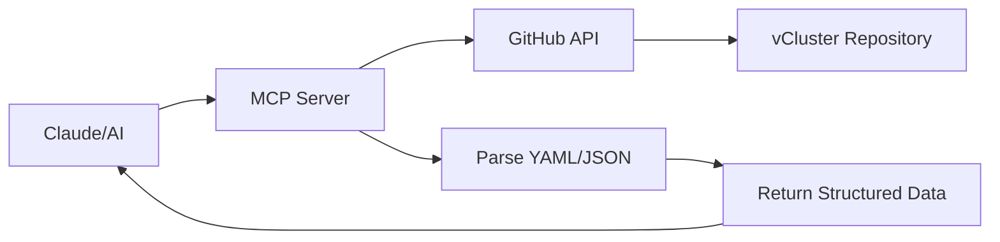

# vCluster YAML MCP Server

[](https://www.npmjs.com/package/vcluster-yaml-mcp-server)
[](https://codecov.io/gh/Piotr1215/vcluster-yaml-mcp)
[](https://nodejs.org/)
[](https://github.com/Piotr1215/vcluster-yaml-mcp-server#token-optimization)
[](https://opensource.org/licenses/MIT)
[](https://hub.docker.com/r/piotrzan/vcluster-yaml-mcp-server)
[](https://modelcontextprotocol.io)

A Model Context Protocol (MCP) server that lets AI assistants query and validate [vCluster](https://github.com/loft-sh/vcluster) YAML configurations directly from GitHub.

## What Does It Do?

This MCP server provides AI assistants with tools to:
- Query vCluster configuration options and schemas
- Validate YAML configurations
- Search for specific settings using natural language
- Query any version with explicit version parameters (stateless)
- Extract validation rules from comments

**Key feature:** No local files needed. All data is fetched live from the vCluster GitHub repository.

## How It Works

The server uses the GitHub API to fetch vCluster YAML configurations, schemas, and documentation directly from the source:

1. **GitHub as Source of Truth**: Queries `github.com/loft-sh/vcluster` repository
2. **Stateless Version Queries**: Every tool accepts an optional `version` parameter (e.g., `v0.19.0`, `main`)
3. **Parallel Version Support**: Query multiple versions simultaneously without state conflicts
4. **Live Data**: Always fetches the latest configuration for the requested version
5. **Smart Caching**: 15-minute in-memory cache to avoid overloading GitHub API



## Installation

### Option 1: Local (stdio)

Run the server locally via npx:

```json
{
  "mcpServers": {
    "vcluster-yaml": {
      "command": "npx",
      "args": ["-y", "vcluster-yaml-mcp-server@latest"]
    }
  }
}
```

### Option 2: Remote (HTTP)

Use the public instance (always running latest version):

```json
{
  "mcpServers": {
    "vcluster-yaml": {
      "type": "http",
      "url": "https://vcluster-yaml.cloudrumble.net/mcp"
    }
  }
}
```

## Command-Line Interface

The package also provides a standalone CLI for quick queries and validation without MCP setup:

```bash
# Quick start with npx (no installation)
npx vcluster-yaml-mcp-server query sync

# Or install globally
npm install -g vcluster-yaml-mcp-server
vcluster-yaml query sync

# Validate configurations with ease
vcluster-yaml validate my-config.yaml
cat my-config.yaml | vcluster-yaml validate -
vcluster-yaml validate my-config.yaml --schema-version v0.24.0

# Shell completion (bash/zsh)
vcluster-yaml completion bash 2>/dev/null > ~/.vcluster-yaml-completion.bash
vcluster-yaml completion zsh 2>/dev/null > ~/.zsh/completion/_vcluster-yaml
```

📖 **[Full CLI Documentation →](docs/CLI.md)** 

## Available Tools

### Version Discovery

**list-versions** - Browse all available vCluster versions
```javascript
// Returns tags (releases) and branches
// Example output: v0.19.0, v0.20.0, main, etc.
```

### Configuration Queries

All query tools accept an optional `version` parameter (defaults to "main"):

**smart-query** - Universal search using dot notation or natural language
```javascript
smart-query --query="controlPlane.ingress.enabled" --version="v0.19.0"
smart-query --query="namespace syncing" --version="main"
smart-query --query="etcd"  // Defaults to "main"
```

**Output Format (kubectl-style):**
```
Found 4 matches for "replicas" in chart/values.yaml (v0.24.0)

━━━━━━━━━━━━━━━━━━━━━━━━━━━━━━━━━━━━━━━━━━━━━━━━━━━━━━━━━━━━

MATCH: controlPlane.statefulSet.highAvailability.replicas
TYPE:  integer
VALUE: 1

━━━━━━━━━━━━━━━━━━━━━━━━━━━━━━━━━━━━━━━━━━━━━━━━━━━━━━━━━━━━

MATCH: controlPlane.coredns.deployment.replicas
TYPE:  integer
VALUE: 1

━━━━━━━━━━━━━━━━━━━━━━━━━━━━━━━━━━━━━━━━━━━━━━━━━━━━━━━━━━━━

MATCH: controlPlane.statefulSet.highAvailability
TYPE:  object

FIELDS:
  replicas <integer>
    value: 1

  leaseDuration <integer>
    value: 60

  renewDeadline <integer>
    value: 40

  retryPeriod <integer>
    value: 15

RELATED CONFIGS:
  • controlPlane.statefulSet.resources - Resource limits for HA mode
  • controlPlane.backingStore.etcd.deploy.statefulSet.highAvailability
```

**Features:**
- ✅ **Structured output** - kubectl-style format
- ✅ **Type information** - Every value shows its type (integer, string, boolean, array, object)
- ✅ **Relevance ranking** - Exact matches appear first, results sorted by relevance
- ✅ **Related configs** - Suggests commonly configured fields together
- ✅ **Smart formatting** - Objects show structure, not full content dumps
- ✅ **LLM-friendly** - Easy to parse and understand for AI assistants

### Config Creation & Validation

All validation tools accept an optional `version` parameter (defaults to "main"):

**create-vcluster-config** - Create and validate configs in one step (PRIMARY TOOL)
```javascript
// Claude uses this when generating configs for you
// Ensures every generated config is validated before you see it
create-vcluster-config --yaml_content="<generated-yaml>" --description="Node sync config" --version="v0.24.0"

// Returns:
// ✅ Configuration validated successfully!
// Version: v0.24.0
// Section: sync
// Validation time: 45ms
//
// ### Configuration:
// [your YAML here]
```

**validate-config** - Validate existing YAML configs
```javascript
// Validate user-provided configs against specific version
validate-config --content="<your-yaml>" --version="v0.24.0"

// Validate files from GitHub
validate-config --file="chart/values.yaml" --version="main"

// Works with full configs or partial snippets (auto-detects section)
// Returns: { valid: true/false, errors: [...], section: "...", version: "...", elapsed_ms: <100 }
```

**extract-validation-rules** - Get validation rules from YAML comments
```javascript
extract-validation-rules --section="controlPlane" --version="v0.24.0"
// Returns: { rules, enums, dependencies, defaults }
// Extracts constraints like "Valid values: a, b, c"
```

## Usage Examples

### Interactive Config Creation (Primary Workflow)

Ask Claude:
> "Create a vCluster config with node sync enabled and etcd embedded"

Claude will:
1. Use `smart-query` or `extract-validation-rules` to research options
2. Generate the YAML configuration
3. **Automatically** call `create-vcluster-config` to validate
4. Return validated, ready-to-use configuration

**Why this works:** The `create-vcluster-config` tool forces Claude to validate every config it generates. You'll always get validated configs.

### Validate User-Provided Configuration

Ask Claude:
> "Is this ingress configuration valid for vCluster v0.24?"
> ```yaml
> ingress:
>   enabled: true
>   host: "my-vcluster.example.com"
> ```

Claude will:
1. Use `validate-config` with `--version="v0.24.0"` parameter
2. Report any validation errors with specific paths
3. Suggest fixes if needed

### Explore vCluster Options

Ask Claude:
> "What high availability options are available in vCluster v0.19.0?"

Claude will use:
- `smart-query` with `--version="v0.19.0"` to find HA-related settings
- No need to "switch" versions - query directly with version parameter

### Compare Versions

Ask Claude:
> "How did the sync.fromHost configuration change between v0.19.0 and v0.20.0?"

Claude will use:
- `smart-query` with `--version="v0.19.0"` for first version
- `smart-query` with `--version="v0.20.0"` for second version
- Can query both versions in parallel (stateless design)

## Token Optimization

This server is designed for efficient token usage with the new kubectl-style format:

| Tool | Tokens | Strategy | Performance |
|------|--------|----------|-------------|
| create-vcluster-config | ~300-600 | Validation + formatted response with emoji indicators | <100ms |
| validate-config | ~200-500 | Fast validation, precise errors only | <100ms |
| smart-query | ~800-1.5K | Structured output (was ~2K with JSON dumps), limits to 50 matches | <100ms |
| extract-validation-rules | ~2-5K | Section-specific filtering, cache for knowledge base | <100ms |

## Development

```bash
# Install dependencies
npm install

# Run locally (stdio)
node src/index.js

# Test with MCP Inspector
npx @modelcontextprotocol/inspector node src/index.js
# Open http://localhost:5173

# Run tests
npm test

# Run HTTP server locally
npm run start:http
# Server runs on http://localhost:3000
```

## Technical Details

- **SDK**: `@modelcontextprotocol/sdk` v1.20.1 (Streamable HTTP transport)
- **Node**: >=18
- **Transport**: Both stdio (local) and HTTP/SSE (remote)
- **Dependencies**: `js-yaml` for parsing, `node-jq` for querying, `node-fetch` for GitHub API

## Release Process

This project uses automated CI/CD workflows for releases to npm, Docker Hub, and GitHub Releases.

📖 **[Release Documentation →](docs/RELEASING.md)**

## Links

- [vCluster GitHub](https://github.com/loft-sh/vcluster)
- [Model Context Protocol](https://modelcontextprotocol.io)
- [MCP Specification](https://spec.modelcontextprotocol.io)

## License

MIT
